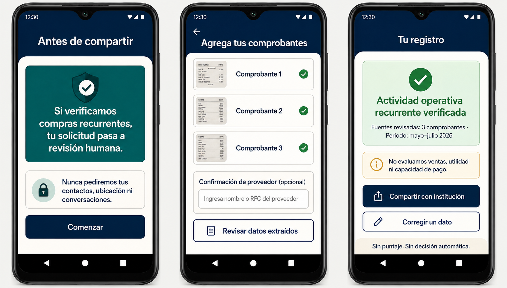
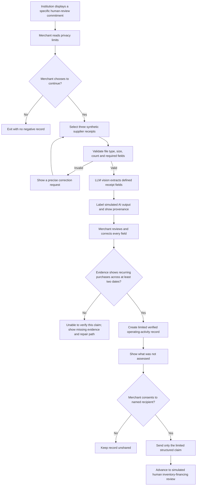
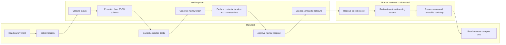

# PACKET — Week 2 Business Bending

**Working title:** Huella  
**Builder:** Yonathan Zeitoune Mattout  
**Declared lens:** USER  
**Primary vacuum:** Evidence-to-Action  
**Status:** Finalized against the Team 6 Blueprint

## Problem in my words

Mexico has merchants whose economic activity is real but difficult to present in the format that formal institutions expect. Nadir Redón Texta, a seasonal informal reseller in Zihuatanejo, could not obtain a bank credit line even though he reported variable monthly income and later repaid a small Stori line consistently. Reuters recorded his words: “I earn from 4,000 to 8,000 pesos every month, since my business is informal and seasonal.”

The problem is not simply that an institution fails to explain a rejection. A clearer explanation does not create acceptable evidence. The sharper need is a low-burden way for a cash-based merchant to carry a narrow, truthful claim about recurring operating activity without exposing private conversations, contacts, or neighborhood data—and without converting that evidence into another credit score.

## Exact user

The first user is a Mexican informal or semi-formal seasonal merchant who buys inventory repeatedly, sells partly in cash, uses an inexpensive Android phone, and lacks conventional proof of stable income. The user may have three recent supplier receipts but no clean business bank account and no desire to share personal WhatsApp conversations, contacts, or precise location.

This user needs inventory financing before a high-sales season. Waiting months to build history with a very small credit line can make the financing arrive after the moment when it is valuable.

## Success definition

**Before the module closes, the live URL will let a user complete this working slice:**

1. Read an institution’s specific commitment before sharing any evidence.
2. Select three clearly invented supplier-receipt images.
3. See AI-extracted fields in a structured form and correct them before continuing.
4. Generate a JSON-backed record that states exactly what was and was not verified.
5. Share the limited record with a simulated institution only after explicit consent.
6. Receive either a defined human-review next step or an achievable repair request—never a credit score.

The target completion time is under five minutes on a low-cost phone. This is a **pilot target**, not a proven performance claim.

## Image-generated mockup



The mockup makes the consequence visible before upload: “Si verificamos compras recurrentes, tu solicitud pasa a revisión humana.” It also states the boundary of the claim: “No evaluamos ventas, utilidad ni capacidad de pago.”

### Invented demo evidence

The prototype uses exactly three purpose-built supplier receipts dated May 14, June 7 and July 9, 2026. Every image is visibly labeled **“DATOS FICTICIOS — DEMO ACADÉMICA”** and contains no real person, company, address, tax identity or transaction. The receipts establish only a testable recurring-purchase pattern for the prototype; they are not evidence of sales, profit, cash flow or repayment capacity.

## Feature flow



## Actor swimlane



## Global benchmark line

**The best existing solution on Earth for this is India’s Account Aggregator framework:** it enables standardized, consent-based exchange of financial data between regulated institutions at population scale.

**Mine differs or localizes by:** Huella begins before activity becomes formal financial data; it uses narrowly defined supplier-document claims from a Mexican cash-based merchant, stops before scoring or underwriting, and requires a consequential review commitment before evidence is shared.

Brazil’s Open Finance reinforces the portability model, while Nova Credit’s Cash Atlas shows why institutional integration often pushes evidence toward lender-ready attributes and scores. Huella deliberately preserves only a limited verified claim.

## Long view — three years

In three years, Huella could become a consent-based evidence rail through which Mexican informal merchants carry verified operating claims across inventory financiers, insurers, landlords, and procurement platforms. Each institution would publish in advance what evidence unlocks which human process, while the merchant could correct, revoke, and reuse individual claims without exposing an entire private life. The product would remain an evidence and repair infrastructure—not a universal economic identity, score, or automatic decision engine.

## Working slice

The Week 2 build is one end-to-end path: a merchant views a pre-commitment, submits three invented supplier receipts, reviews a simulated AI extraction, receives a narrowly labeled operating-activity record, and shares it with a simulated institution that returns a human-review step or repair request.

### Exact record language

> Recurring operating activity verified from the listed sources between [date] and [date]. Sales, profitability, and repayment capacity were not assessed.

### Final shadow clause

Opportunity may not be determined by association. Family relationships, contact lists, social graphs, customer identities, precise home location, and neighborhood-level risk proxies may not be used to judge repayment ability. Missing evidence is never treated as negative evidence, and a record can be shared only with a named institution that first displays a specific review consequence and repair path.

## Blueprint conditions honored

1. **Source linkage and uncertainty:** every extracted field links to its receipt; the interface labels AI extraction as simulated and distinct from verification.
2. **Defined action:** the institution commits before evidence selection that qualifying evidence advances to human inventory-financing review.
3. **Visible gaps and repair — primary condition honored:** the record lists sales, profitability and repayment capacity as unassessed and provides a realistic optional repair path without turning absence into a negative signal.
4. **No black-box speculation:** Huella explains only the status of submitted evidence and never guesses why a lender rejected or priced a user.
5. **Shadow clause:** the schema and interface contain no family, contacts, social graph, customer identity, precise home location or neighborhood-risk fields.
6. **Meaningful appeal:** the simulated reviewer has explicit authority to correct the record and change the next step.

## Scope cut — what I am not building

- No credit score, default probability, risk grade, recommendation, approval, or denial.
- No verification of sales, profit, net cash flow, or repayment capacity.
- No universal “economic passport.”
- No access to contacts, social networks, private messages, precise location, or neighborhood.
- No live lender integration or real inventory-financing decision.
- No reliable fraud-detection claim for altered informal receipts.
- No automatic inference from merchant category, supplier identity, or transaction timing.
- No real personal data in the demo, seed data, screenshots, or logs.
- No promise that an appeal is resolved within a particular time; the prototype demonstrates the required path only.

## Architecture and stack

| Layer | Final choice | Purpose and honesty boundary |
|---|---|---|
| Interface | Standards-based HTML, CSS and JavaScript | Dependency-free, mobile-first Spanish workflow with large text and explicit consent. |
| Input validation | Shared JavaScript validation module | Enforce exactly three demo sources, valid dates/amounts, and text-length limits on every transition. |
| LLM layer | Deterministic pre-generated vision output | Extract only supplier name, purchase date, total and source reference. It is visibly labeled **simulated AI extraction — demo data** and is never called verification. |
| Structured data | Schema-constrained JSON objects | Store provenance, corrections, claim boundaries, missing evidence, recipient and consent. No score field exists in the schema. |
| File handling | Ephemeral processing; no permanent receipt storage in the prototype | Reduce privacy and security exposure. Only invented demo images are accepted during grading. |
| Deployment | Vercel | Public live URL and server-side environment variables. |
| Version control | GitHub | Minimum five meaningful commits and two documented deploys. |
| Testing | Node's built-in test runner plus manual mobile checks | Mechanical tests, one documented bug-fix-redeploy cycle, and persona test. |

## Provisional structured-data schema

```json
{
  "recordId": "demo-record-001",
  "evidence": [
    {
      "sourceId": "receipt-001",
      "sourceType": "supplier_receipt",
      "supplierDisplayName": "Proveedor Demo",
      "purchaseDate": "2026-05-14",
      "totalMxn": 1860,
      "extractionMode": "simulated_ai",
      "userConfirmed": true
    }
  ],
  "verifiedClaim": {
    "claimType": "recurring_operating_activity",
    "periodStart": "2026-05-14",
    "periodEnd": "2026-07-09",
    "label": "Recurring operating activity verified from the listed sources between 2026-05-14 and 2026-07-09.",
    "notAssessed": ["sales", "profitability", "repayment_capacity"]
  },
  "consent": {
    "recipient": "Inventario Justo — Demo",
    "commitment": "Advance past automatic rejection to a human inventory-financing review.",
    "shared": false
  }
}
```

## Security floor before code

- API keys, if used, exist only in Vercel environment variables and never in source code.
- The public prototype uses only invented, clearly labeled data and does not persist uploaded images.
- Any future personal-data persistence requires Google authentication and Supabase Row Level Security before launch.
- Every field has type, length, count, and file-size validation; no raw textbox content is inserted directly into a database or prompt.
- LLM output is parsed against a fixed schema and shown to the user for correction before it can become evidence.
- Consent is recipient-specific and occurs after the record and its limitations are visible.

## Test plan

### Mechanical pass

| Test | Expected result |
|---|---|
| Start without accepting the pre-commitment | Upload remains unavailable. |
| Submit fewer or more than three receipts | Clear validation message; no negative inference. |
| Upload an unsupported file or oversized image | File rejected with an actionable correction. |
| Inspect AI extraction | “Simulated AI” label is visible and every field is editable. |
| Correct a date or amount | Corrected value persists in the structured record. |
| Use three receipts across at least two dates | Limited recurring-activity claim is generated. |
| Evidence is insufficient | No failure score; exact missing evidence and repair step appear. |
| View final record | Disclosure says sales, profitability and repayment capacity were not assessed. |
| Refuse sharing | Record remains unshared and refusal creates no penalty. |
| Share with named demo institution | Commitment is shown again; only limited record is transmitted. |
| Search the product UI and data schema | No score, probability, location, contacts, neighborhood or social fields exist. |
| Run on narrow mobile viewport | No horizontal scrolling; primary actions remain readable and tappable. |

The mechanical pass must identify at least one real bug. I will document the failure, fix, commit, redeploy, and rerun the affected test.

### Persona test

Use a fresh chat with an invented Nadir-inspired persona: **Javier, 41, a seasonal clothing reseller in Guerrero who uses WhatsApp, reads slowly, mostly receives cash, distrusts financial apps, and quietly abandons tasks when privacy language is unclear.** State explicitly that Javier is synthetic and that all screenshots contain invented data.

Walk Javier through screenshots in order and ask him to narrate where he hesitates, what he believes the product is promising, what he refuses to share, and where he would quit. Log every confusion and fix the single worst one before the final deploy. The main hypothesis to test is whether he mistakes “operating activity verified” for a guarantee of credit approval.

## Blueprint reconciliation complete

- The final primary vacuum is **Evidence-to-Action**.
- All six Team 6 conditions are incorporated above.
- Yonathan's slice most directly honors **Condition 3: visible evidence gaps with realistic repair paths**.
- The Shadow Clause is reproduced in the product's prohibited-field list.
- Money's dissent survives through an Explanation + Repair layer that never guesses hidden lender logic.
- The approved Packet has been converted into the implementation prompt and commit plan.

## Sources

- [Reuters report on Nadir Redón Texta and Stori, republished by KFGO](https://kfgo.com/2022/03/29/mexican-startup-stori-boosts-investments-as-it-targets-the-unbanked/)
- [Sahamati — India Account Aggregator ecosystem](https://sahamati.org.in/)
- [Sahamati — Financial Information User FAQ and data boundaries](https://sahamati.org.in/financial-information-user-fiu/)
- [Open Finance Brasil — official data portal](https://dados.openfinancebrasil.org.br/)
- [Nova Credit — Cash Atlas](https://www.novacredit.com/corporate-blog/nova-credit-introduces-cash-atlas)
